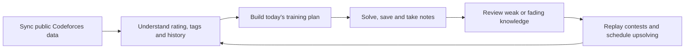

<p align="center">
  
</p>

<h1 align="center">CF Compass</h1>

<p align="center">
  <strong>A local-first training loop for OI, ICPC, Codeforces, and competitive programmers.</strong><br />
  Find the right problem, train with purpose, review what fades, and turn every contest into evidence.
</p>

<p align="center">
  <a href="https://github.com/qeffg/cf-compass/actions/workflows/build.yml"></a>
  <a href="https://github.com/qeffg/cf-compass/releases/latest"></a>
  <a href="./LICENSE"></a>
  
</p>

<p align="center">
  <a href="./README.md">简体中文</a> · <strong>English</strong>
</p>

<p align="center">
  <strong><a href="https://github.com/qeffg/cf-compass/releases/latest">Download the one-click Windows x64 portable app</a></strong>
</p>


## Why CF Compass?

Competitive programming rarely suffers from a shortage of problems. The real problem is fragmentation: bookmarks live in one place, submissions in another, notes disappear, and a finished contest leaves little more than a rating change.

CF Compass connects those fragments into one daily loop:



Your data stays local. CF Compass does not ask for a Codeforces password, submit code for you, or require another cloud account.

## Features

### Problem workspace — find the next useful problem

Filter the full Codeforces problem set by rating, official tags, keywords, completion state, favorites, and repeated ACs. The same page combines problem discovery with your recent activity, tag distribution, solved count, and personal progress.

CF Compass turns a public problem archive into a problem set that is relevant to *you*.

### Daily training — convert goals into a plan you can execute


The daily plan is split into three adjustable bands:

- **Consolidate:** easier problems for speed, accuracy, and complete fundamentals.
- **Steady:** problems around your current level for the main training load.
- **Challenge:** slightly harder problems that probe the edge of your ability.

You can regenerate one band without throwing away the entire plan. Due reviews, weak-tag recommendations, target ratings, recommendation reasons, completion progress, and the current streak remain visible on the same page.

### Review library — make AC the beginning, not the end


Save mistakes, upsolving targets, and worthwhile problems to a spaced-review queue. Attach local notes, rate each review as difficult/mastered/easy, and filter the library by tags, rating, favorite state, first AC, or repeated AC.

#### Review timeline


The timeline reconstructs training by day. Each entry keeps the problem, rating, tags, first accepted time, latest accepted time, and AC count together. It helps reveal long-unvisited topics and difficult problems that still have only one successful attempt.

### Contest replay — turn a rating change into actionable evidence


Browse rated contests you actually joined and inspect estimated performance, official rank, rating delta, solved count, attempts, and per-problem state. CF Compass distinguishes in-contest solves, later upsolving, and unresolved tasks; any unfinished problem can be sent directly into the review workflow.

Performance is a local training estimate based on the MIT-licensed Carrot algorithm, not an extra official Codeforces rating.

### Contest center — search the past and choose the next contest


Search contests by name or ID and combine time, status, type, and participation filters. CF Compass recognizes Div.1–Div.4, Educational, Global, ICPC, and special formats, then shows duration, scale, your participation state, and a rating-aware training suggestion.

Contest Center answers “what should I join next?” Contest Replay answers “what did the last one teach me?”

### Local template library — source code with meaning attached


Choose an existing algorithm-template directory and CF Compass builds a lightweight local index without copying or uploading your source files. Search by name, summary, relative path, category, or language; adjust classifications; and open the original file directly in VS Code.


Each template can carry a compact readable reference: problem idea, input, output, key constraints, use cases, core approach, and complexity. The formatter normalizes sections, spacing, common inequalities, powers, subscripts, multiplication signs, and scientific notation so the summary stays readable instead of leaking raw LaTeX commands.

### Data center — your training history belongs to you


- Incremental sync downloads only new submissions and reuses a valid problem-set cache.
- Notes, reviews, settings, favorites, and training history remain on the computer.
- JSON export/import makes migration and recovery straightforward.
- Automatic daily backups and pre-import snapshots protect against mistakes.
- A local activity timeline explains what changed and when.

See the [Data Center guide](./docs/DATA_CENTER_GUIDE.md) for first sync, migration, restore, cache, and backup details. The guide is currently in Chinese; contributions for an English translation are welcome.

## Three original themes


The public edition includes three original CSS themes and does not depend on third-party character art:

| Theme | ID | Primary color | Character |
| --- | --- | --- | --- |
| Sky | `sky` | `#2F86F6` | clear and focused |
| Mint | `mint` | `#43C7A1` | calm for long sessions |
| Coral | `coral` | `#F27D9B` | vivid and high-contrast |

Optional local PNG, JPG, WebP, MP4, or WebM backgrounds can be imported through **Appearance → Local characters and backgrounds**. These files stay in the local application-data directory and are never bundled with the repository or synced online. See the [optional asset guide](./docs/OPTIONAL_CHARACTER_ASSETS.md) and [appearance guide](./docs/APPEARANCE_GUIDE.md) for sources, license boundaries, and controls.

## Quick start

### Windows — one file, double-click to run

Open [Latest Release](https://github.com/qeffg/cf-compass/releases/latest) and download:

```text
CF-Compass-3.11.5-portable.exe
```

No installer wizard is required. A matching `.sha256` file is included for integrity verification.

The public build is currently unsigned because the project does not own a commercial code-signing certificate. Windows SmartScreen may therefore show “Unknown publisher.” Download only from this repository and verify SHA-256 before running.

### Run from source

Requirements: Windows 10/11, Node.js 22, pnpm 11.19.0, and Git.

```powershell
git clone https://github.com/qeffg/cf-compass.git
cd cf-compass
corepack enable
pnpm install --frozen-lockfile
pnpm desktop
```

Enter a Codeforces handle after launch to sync its public data.

## Build and verification

```powershell
pnpm verify         # production renderer build
pnpm desktop:pack   # unpacked Windows application
pnpm desktop:build  # one-file Windows portable executable
```

GitHub Actions installs dependencies, audits production packages, runs focused regression tests, builds the renderer, packages the real Windows application, and uploads the executable with its SHA-256 checksum.

## Privacy and open-source boundary

- Codeforces integration reads public API data only.
- User data, notes, template summaries, settings, and backups stay local by default.
- The repository contains no real user database, access token, or maintainer computer path.
- Third-party character artwork, game assets, and reusable wallpapers are not included in the source tree, Windows executable, or MIT License.
- Documentation screenshots use fictional data or explicitly authorized training statistics and omit device paths, private backup names, and credentials.

Before opening an issue, remove any handle, local path, log content, or backup detail you do not want to publish. Report vulnerabilities privately through **Security → Report a vulnerability**; see [SECURITY.md](./SECURITY.md).

## Contributing

Issues, ideas, translations, and pull requests are welcome. Start with [CONTRIBUTING.md](./CONTRIBUTING.md), follow the [Code of Conduct](./CODE_OF_CONDUCT.md), and include privacy-safe screenshots for visual changes.

## License and attribution

Original source code, the application icon, and the three CSS themes are available under the [MIT License](./LICENSE). Third-party dependencies and the Carrot algorithm attribution are documented in [CREDITS.md](./CREDITS.md).

CF Compass is an independent community project and is not affiliated with or endorsed by Codeforces.
