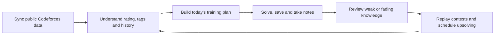

<p align="center">
  
</p>

<h1 align="center">CF Compass</h1>

<p align="center">
  <strong>A local-first training loop for OI, ICPC, Codeforces, and competitive programmers.</strong><br />
  Find the right problem, train with purpose, review what fades, and turn every contest into evidence.
</p>

<p align="center">
  <a href="https://github.com/Binah-Dev/cf-compass/actions/workflows/build.yml"></a>
  <a href="https://github.com/Binah-Dev/cf-compass/releases/latest"></a>
  <a href="./LICENSE"></a>
  
  
</p>

<p align="center">
  <a href="./README.md">简体中文</a> · <strong>English</strong>
</p>

<p align="center">
  <strong><a href="https://github.com/Binah-Dev/cf-compass/releases/latest">Download for Windows, Linux, or macOS</a></strong>
</p>


## Current release: v4.3.0

v4.3.0 adds Custom Training and Windows installer updates. Download it from [Latest Release](https://github.com/Binah-Dev/cf-compass/releases/latest).

- Compose a timed session from the problem library, favorites, or study plan, inspect previous attempts, and choose the problem order. Starting locks the selection; sessions and the absolute countdown survive restart.
- Hide tags and ratings independently during training and in results. Synchronization matches the bound account, complete problem ID, and session submission window. Custom sessions never enter official or combined estimated Rating.
- Windows x64 installer editions check stable releases under **Data Center → App Updates**. Downloading and installing require explicit user actions, and active Custom Training blocks installation. Windows v4.2.2 and older require one manual installation of v4.3.0 first.
- A dedicated stopwatch-and-play rail icon identifies Custom Training and follows the existing icon style.

The static AppImage runtime, AppStream metadata, `.AppImage.zsync` support for external tools, and offline demo workbench introduced in v4.2.2 remain available. AppImage editions use external update tools and do not check for, download, or install updates inside the app.

The combined Rating estimate, Daily Training, contest reviews and local notes from v4.2.1 remain available. The estimate processes eligible official and virtual sessions chronologically as a training reference without overwriting official data; a manual training rating takes priority. See the [v4.2.1 rules](./docs/releases/v4.2.1.md). Core training and estimates require no AI.

Ubuntu / Debian users should prefer `.deb`. On Ubuntu 24.04 hosts that restrict user namespaces, AppImage requires a one-time administrator-approved installation at a fixed path with a matching AppArmor profile. See the [Linux installation and sandbox guide](./docs/linux-appimage.md); AppImage compatibility is not universal across Linux systems.

| v4 highlight | What it enables |
| --- | --- |
| Evidence-based contest review | Inspect the real submission timeline and adjacent-version Diffs, then request an optional AI review draft. |
| Actionable recommendations | Rank candidates from the locally synced problem set, inspect the evidence, and then save, annotate, or add a problem to the target list. |
| One learning record | Use the same notes and target list from the problem set, daily training, reviews, contests, and recommendations. |
| Customizable workbench | Hide, restore, and reorder rail items; choose a UI scale; and review contests in a full-page layout. |

See the [v4.3.0 release notes](./docs/releases/v4.3.0.md), the historical Linux validation in [v4.2.2](./docs/releases/v4.2.2.md), and the complete [v4.0.0 feature notes](./docs/releases/v4.0.0.md).

## Why CF Compass?

Competitive programming rarely suffers from a shortage of problems. The real problem is fragmentation: bookmarks live in one place, submissions in another, notes disappear, and a finished contest leaves little more than a rating change.

CF Compass connects those fragments into one daily loop:


```mermaid
flowchart LR
    A[Sync public Codeforces data] --> B[Understand rating, tags and history]
    B --> C[Build today's training plan]
    C --> D[Solve, save and take notes]
    D --> E[Review weak or fading knowledge]
    E --> F[Replay contests and schedule upsolving]
    F --> B
```

Your data stays local. CF Compass does not ask for a Codeforces password, submit code for you, or require another cloud account.

## Simplified Chinese and English UI

CF Compass now provides a complete **简体中文 / English interface switch**. Open **Appearance → Interface Language** from the lower-left rail and choose a language. The change is immediate, stored locally, and retained after restarting the app.

- On first launch, CF Compass follows the system language: Chinese systems start in Simplified Chinese and all other systems start in English. A previously saved choice is never overwritten.
- The problem workspace, daily training, review library and timeline, Contest Center, Contest Replay, Template Library, Data Center, note drawer, and native file dialogs share the same language setting.
- Dates, numbers, dynamic counters, status messages, search fields, and accessibility labels follow the selected locale.
- Official Codeforces problem names, local template filenames, template summaries, and user notes remain in their original language; CF Compass never machine-translates user-authored content without permission.


<p align="center"><sub>English UI with fictional demo data and no private device paths</sub></p>

## Features

### Problem workspace — find the next useful problem

Filter the full Codeforces problem set by rating, official tags, keywords, completion state, favorites, and repeated ACs. The same page combines problem discovery with your recent activity, tag distribution, solved count, and personal progress.

CF Compass turns a public problem archive into a problem set that is relevant to *you*.

### Daily training — convert goals into a plan you can execute


The daily plan is split into three adjustable bands:

- **Consolidate:** easier problems for speed, accuracy, and complete fundamentals.
- **Steady:** problems around your current level for the main training load.
- **Challenge:** slightly harder problems that probe the edge of your ability.

You can regenerate one band without throwing away the entire plan. Due reviews, weak-tag recommendations, target ratings, recommendation reasons, completion progress, and the current streak remain visible on the same page.

### Review library — make AC the beginning, not the end


Save mistakes, upsolving targets, and worthwhile problems to a spaced-review queue. Attach local notes, rate each review as difficult/mastered/easy, and filter the library by tags, rating, favorite state, first AC, or repeated AC.

#### Review timeline


The timeline reconstructs training by day. Each entry keeps the problem, rating, tags, first accepted time, latest accepted time, and AC count together. It helps reveal long-unvisited topics and difficult problems that still have only one successful attempt.

### Contest replay — turn a rating change into actionable evidence


<p align="center"><sub>Original replay overview from an earlier UI, retained to illustrate the contest list and results summary. The screenshots below show the unified layout in development.</sub></p>


<p align="center"><sub>Official contests: consistent session metrics with official rank and Rating changes. Fictional test data.</sub></p>


<p align="center"><sub>Virtual contests: the same layout and problem actions, with session estimates and reference placement explicitly separated from official results. Synthetic data illustrates the interface, not prediction accuracy.</sub></p>

Browse official Rated, virtual and other unrated sessions in one list. Inspect session duration, first AC, submissions and per-problem state, with official Rating changes or clearly labeled virtual estimates in the results area. CF Compass distinguishes in-contest solves, later upsolving, and unresolved tasks; any unfinished problem can be sent directly into the review workflow.

Performance is a local training estimate based on the MIT-licensed Carrot algorithm, not an extra official Codeforces rating.

### Optional AI contest review

AI contest review turns contest results and submission history into actionable review notes. Configure the DeepSeek API in **Data Center → AI Contest Review**, then open **AI Review** or **Enhanced review** from a contest. Results remain a draft until you choose **Save review**.

- Standard review uses the contest summary, per-problem submission statistics, contest state, and local notes to identify time-management patterns, strengths, weaknesses, and next actions.
- Source-assisted review is a separate opt-in capability. It needs your own Codeforces API key and secret, builds the complete contest submission timeline, and generates adjacent-version Diffs for submissions whose source was retrieved before sending the code evidence to AI.
- Source code, Diffs, and API credentials are excluded from ordinary study data, JSON exports, and automatic backups. Reopening source-assisted review reads the submission source again.
- The feature is off by default and does not run during automatic sync. AI output is a review aid only; it does not replace official Codeforces results or modify notes, review feedback, or training plans automatically.
- Recommendation candidates come from the locally synced Codeforces problem set. Hard filters remove contest originals, solved, already planned, duplicate, and invalid candidates before the UI shows the problem, difficulty, and recommendation evidence. Saving, annotating, or adding a target remains an explicit user action.


### Global notes and target list — give “later” a real home

- Open the same problem note from the problem workspace, daily training, review library, contest replay, AI recommendations, or target list.
- Collect problems you want to learn, upsolve, or revisit, then sort them by date, difficulty, or status.
- Detach and resize the target-list window; completed entries remain crossed out so the training trail stays visible.
- Notes and targets stay synchronized across windows and travel with local export, import, and backup data.

### Contest center — search the past and choose the next contest


Search contests by name or ID and combine time, status, type, and participation filters. CF Compass recognizes Div.1–Div.4, Educational, Global, ICPC, and special formats, then shows duration, scale, your participation state, and a rating-aware training suggestion.

Contest Center answers “what should I join next?” Contest Replay answers “what did the last one teach me?”

### Local template library — source code with meaning attached


Choose an existing algorithm-template directory and CF Compass builds a lightweight local index without copying or uploading your source files. Search by name, summary, relative path, category, or language; adjust classifications; and open the original file directly in VS Code.


Each template can carry a compact readable reference: problem idea, input, output, key constraints, use cases, core approach, and complexity. The formatter normalizes sections, spacing, common inequalities, powers, subscripts, multiplication signs, and scientific notation so the summary stays readable instead of leaking raw LaTeX commands.

### Data center — your training history belongs to you


- Incremental sync downloads only new submissions and reuses a valid problem-set cache.
- Notes, reviews, settings, favorites, and training history remain on the computer.
- JSON export/import makes migration and recovery straightforward.
- Automatic daily backups and pre-import snapshots protect against mistakes.
- A local activity timeline explains what changed and when.

See the [Data Center guide](./docs/DATA_CENTER_GUIDE.md) for first sync, migration, restore, cache, and backup details. The guide is currently in Chinese; contributions for an English translation are welcome.

### Training analytics — explore progress at every scale

Switch between all time, one year, three months, one month, two weeks, or a custom date range. Summary metrics, the Codeforces Rating chart, algorithm acceptance ranking, and daily Accepted rhythm all follow the same window. Rating points expose contest changes and ranks; scroll over the chart to zoom around the pointer, or use the navigator handles for precise selection. The complete algorithm ranking remains vertically scrollable instead of hiding lower entries.

### Customizable desktop workbench

- Hide unused rail items, restore them from settings, and drag frequently used destinations into the order you prefer.
- Contest Replay uses a full-page layout for timelines, per-problem state, and AI evidence instead of squeezing them into a narrow drawer.
- Small, medium, and large UI scales work alongside the saved language, theme, background, and optional local-asset settings.
- The desktop app provides native windows, file selection, VS Code handoff, and local backups; browser preview remains available for quick UI inspection.

## Three original themes


The public edition includes three original CSS themes and does not depend on third-party character art:

| Theme | ID | Primary color | Character |
| --- | --- | --- | --- |
| Sky | `sky` | `#2F86F6` | clear and focused |
| Mint | `mint` | `#43C7A1` | calm for long sessions |
| Coral | `coral` | `#F27D9B` | vivid and high-contrast |

Optional local PNG, JPG, WebP, MP4, or WebM backgrounds can be imported through **Appearance → Local characters and backgrounds**. These files stay in the local application-data directory and are never bundled with the repository or synced online. See the [optional asset guide](./docs/OPTIONAL_CHARACTER_ASSETS.md) and [appearance guide](./docs/APPEARANCE_GUIDE.md) for sources, license boundaries, and controls.


<p align="center"><sub>Local asset library illustration. Third-party character art is supplied locally by the user; original assets are not bundled with the repository or installers.</sub></p>

### Appearance and automation controls


<p align="center"><sub>Appearance and background visibility controls from an earlier version. These existing screenshots use the Chinese interface; current controls may differ.</sub></p>


<p align="center"><sub>Automation options are controlled by local settings.</sub></p>

## Quick start


### Desktop downloads

Open [Latest Release](https://github.com/Binah-Dev/cf-compass/releases/latest) and choose the v4.3.0 package for your device. The release contains six packages and three update assets:

| Platform or purpose | File |
| --- | --- |
| Windows x64 (recommended installer) | `CF-Compass-4.3.0-Windows-x64-Setup.exe` |
| Windows x64 (portable) | `CF-Compass-4.3.0-Windows-x64-portable.exe` |
| Windows installer update data | `CF-Compass-4.3.0-Windows-x64-Setup.exe.blockmap` |
| Windows stable update metadata | `latest.yml` |
| Linux x64 AppImage | `CF-Compass-4.3.0-x86_64.AppImage` |
| Linux AppImage update data | `CF-Compass-4.3.0-x86_64.AppImage.zsync` |
| Linux Debian x64 | `CF-Compass-4.3.0-Linux-amd64.deb` |
| macOS Intel | `CF-Compass-4.3.0-macOS-x64.dmg` |
| macOS Apple Silicon | `CF-Compass-4.3.0-macOS-arm64.dmg` |

The `.blockmap`, `latest.yml`, and `.zsync` files are read by update tools, not separate applications to run. No standalone `.sha256` or `SHA256SUMS.txt` files are attached.

Windows users should normally choose the `Setup.exe` installer. It extracts the application once during installation, so later launches start directly from the installed files. The `portable.exe` build requires no installation, but it extracts its program files on every launch and can be noticeably slower on low-end disks or while antivirus scanning is active. Packages are built from the same version commit on native runners and made available only after the release gates pass.

Ubuntu / Debian users should prefer `.deb` and install or upgrade it through the system package manager. AppImage is available for portable use. Its static runtime removes the dependency on system `libfuse2`, but mounted execution still needs an accessible FUSE device, helper tools and a compatible desktop environment. On restricted Ubuntu 24.04 hosts, follow the [Linux installation and sandbox guide](./docs/linux-appimage.md) to install at the root-owned `/opt/cf-compass/CF-Compass.AppImage` and grant AppArmor permission for that exact path. The application does not silently disable the Chromium sandbox.

macOS users should select Intel or Apple Silicon. Starting with v3.12.1, macOS apps receive a complete ad-hoc signature and CI signature verification. They are not Apple-notarized because the project does not own a paid Developer ID, so the first launch may still require approval under Privacy & Security.

### Windows upgrades

Windows v4.2.2 and older require one manual installation of the v4.3.0 `Setup.exe`. Afterward, use **Data Center → App Updates** for later stable releases. Startup checking can be disabled; downloading and quitting to install require explicit actions. Portable editions still update manually, and installation is blocked during active Custom Training.

### Linux upgrades

AppImages from v4.2.1 and older have no standard update metadata, so **download the current v4.3.0 manually** from Releases. Stable AppImages starting with v4.2.2 embed an update target for external tools such as AppImageUpdate, which use the adjacent `.AppImage.zsync` release asset to locate later stable versions. The sidecar is update data, not another installer, and does not need to be run. AppImage editions do not automatically check for, download or install updates inside the app.

Metadata checks and local reconstruction do not establish that a live public cross-version upgrade has succeeded. With the Ubuntu 24.04 fixed-path installation above, update a copy in a user-writable directory first, then have an administrator install it at the fixed path; do not run an updater GUI as root. For `.deb`, download the newer package and upgrade through the system package manager. Existing user data and local asset settings are retained; export important data from Data Center before upgrading.

### Download verification and system prompts

The latest Release no longer attaches separate `.sha256` files or `SHA256SUMS.txt`. If you want to check a download, compare its local SHA-256 with the digest GitHub displays beneath that release asset: use `Get-FileHash -Algorithm SHA256 <file>` on Windows, `sha256sum <file>` on Linux, or `shasum -a 256 <file>` on macOS.

If macOS still reports the verified, unnotarized app as damaged, copy it to `/Applications` and run `xattr -dr com.apple.quarantine "/Applications/CF Compass.app"`. Only remove quarantine after downloading from this repository and comparing the local SHA-256 with the digest shown for the GitHub release asset.

The public build is currently unsigned because the project does not own a commercial code-signing certificate. Windows SmartScreen may therefore show “Unknown publisher.” Download only from this repository; if needed, compare the local SHA-256 with the digest shown for the GitHub release asset.

### Run from source

Requirements: Windows, Linux, or macOS; Node.js 22; pnpm 11.19.0; and Git.

```powershell
git clone https://github.com/Binah-Dev/cf-compass.git
cd cf-compass
corepack enable
pnpm install --frozen-lockfile
pnpm desktop
```

Enter a Codeforces handle after launch to sync its public data.

## Build and verification

```powershell
pnpm verify         # production renderer build
pnpm desktop:pack   # unpacked Windows application
pnpm desktop:build  # Windows installer and portable executable
pnpm desktop:build:linux  # Linux AppImage and deb
pnpm desktop:build:mac    # macOS Intel and Apple Silicon dmg; run on macOS
```

GitHub Actions installs dependencies, audits production packages, runs focused regression tests, and builds real packages on Windows, Linux, and macOS. The six packages, AppImage `.zsync`, Windows installer `.blockmap`, and `latest.yml` form the release inventory. A tagged build creates a draft only after every platform succeeds and makes it public after download verification and Windows installer/portable checks. SHA-256 verification remains internal; Windows updating retains SHA-512 validation without publishing separate checksum files.

## Privacy and open-source boundary

- Standard Codeforces synchronization reads public API data only. The optional source-assisted review uses an explicitly configured, authenticated request for your own submissions.
- User data, notes, template summaries, settings, and backups stay local by default.
- The repository contains no real user database, access token, or maintainer computer path.
- Third-party character artwork, game assets, and reusable wallpapers are not included in the source tree, Windows executable, or MIT License.
- Documentation screenshots use fictional data or explicitly authorized training statistics and omit device paths, private backup names, and credentials.

Before opening an issue, remove any handle, local path, log content, or backup detail you do not want to publish. Report vulnerabilities privately through **Security → Report a vulnerability**; see [SECURITY.md](./SECURITY.md).

## Contributing

Issues, ideas, translations, and pull requests are welcome. Start with [CONTRIBUTING.md](./CONTRIBUTING.md), follow the [Code of Conduct](./CODE_OF_CONDUCT.md), and include privacy-safe screenshots for visual changes.

## Custom Training

Open **Custom Training**, identified by its dedicated stopwatch icon, in the left navigation to choose problems from the problem library, favorites, or study plan, set their order and duration, and hide tags and ratings independently during practice. Sessions stay local and resume after restart. Submit on Codeforces using the bound account, synchronize the session results, and use shared notes and the study plan for upsolving. Custom sessions do not affect official or combined estimated Rating. See [Custom Training](./docs/custom-training.md) for counting rules and usage.

## Windows installer updates

Starting with v4.3.0, Windows x64 installer updates are available in **Data Center → App Updates**. Startup checks can be disabled; downloading and quitting to install require your explicit action. Windows v4.2.2 and older need one manual installation of v4.3.0 first. Portable builds and other platforms still update manually. See [Windows installer updates](./docs/windows-auto-update.md) for usage, verification limits, and release assets.

## License and attribution

Original source code, the application icon, and the three CSS themes are available under the [MIT License](./LICENSE). Third-party dependencies and the Carrot algorithm attribution are documented in [CREDITS.md](./CREDITS.md).

CF Compass is an independent community project and is not affiliated with or endorsed by Codeforces.
