<p align="center">
  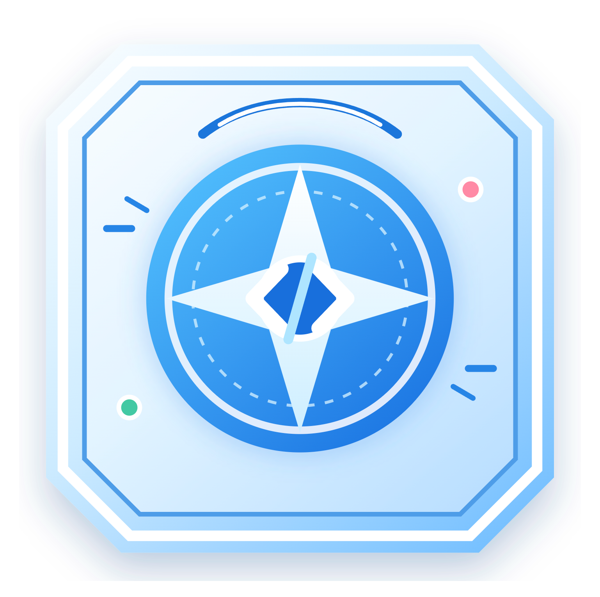
</p>

<h1 align="center">CF Compass</h1>

<p align="center">
  <strong>不是又一个题单收藏夹，而是一套从选题、训练到复盘的完整成长系统。</strong><br />
  让每一次 Codeforces 练习都有方向、有反馈，也有下一步。
</p>

<p align="center">
  <a href="https://github.com/Binah-Dev/cf-compass/actions/workflows/build.yml"></a>
  <a href="https://github.com/Binah-Dev/cf-compass/releases/latest"></a>
  <a href="./LICENSE"></a>
  
  
  
</p>

<p align="center">
  <strong>简体中文</strong> · <a href="./README.en.md">English</a>
</p>

<p align="center">
  <a href="#为什么是-cf-compass">为什么选择它</a> ·
  <a href="#核心功能">核心功能</a> ·
  <a href="#快速开始">快速开始</a> ·
  <a href="#隐私与开源边界">隐私与边界</a> ·
  <a href="#参与贡献">参与贡献</a>
</p>

<p align="center">
  <strong><a href="https://github.com/Binah-Dev/cf-compass/releases/latest">⬇ 下载 Windows / Linux / macOS 版本</a></strong>
</p>

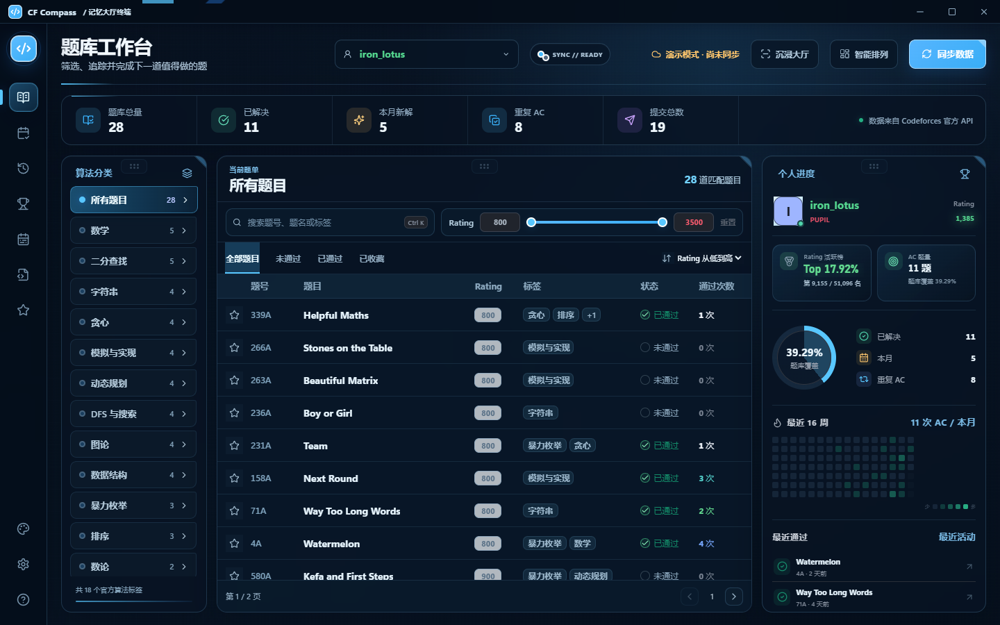

<p align="center"><sub>题库工作台 · 天空蓝主题 · 仓库内置虚构演示数据</sub></p>

## 当前版本：v4.1.0

v4.1 增加虚拟赛独立复盘与本场参考表现分，修复补题队列可见性，并完善自由布局、可读性和交互性能。虚拟赛估算不计入正式 Rating 与总体表现。

| v4 重点 | 现在可以做什么 |
| --- | --- |
| 证据化比赛复盘 | 查看真实提交时间线与相邻版本 Diff，并按需生成 AI 复盘草稿。 |
| 训练建议落地 | 从本地同步题库中筛选候选题，查看推荐依据，再收藏、记录或加入目标题单。 |
| 全局学习记录 | 在题库、今日训练、复习、比赛和推荐结果中使用同一套笔记与目标题单。 |
| 可定制桌面工作台 | 隐藏、恢复和调整左侧功能入口顺序，切换字号与全页赛事复盘布局。 |

完整变化见 [v4.1.0 发布说明](./docs/releases/v4.1.0.md)、[v4.0.1 发布说明](./docs/releases/v4.0.1.md) 与 [v4.0.0 功能说明](./docs/releases/v4.0.0.md)。

## 为什么是 CF Compass

刷题最难的往往不是“没有题”，而是题太多、记录太散、做完之后不知道下一步。CF Compass 把这些断开的环节接成一条可以每天执行的路线：

| 你可能遇到的问题 | CF Compass 给出的答案 |
| --- | --- |
| 收藏了很多题，却每天纠结该做哪一道 | 根据 Rating、标签掌握度与历史记录生成分档今日题单。 |
| 题目 AC 后很快遗忘，错题和笔记散落各处 | 将错题、笔记和复习反馈放进间隔复习队列。 |
| 比赛结束只看到 Rating 涨跌，不知道能力卡在哪里 | 计算表现分，保留逐题状态，并把待补题目接回复习流程。 |
| 题库、比赛、模板和训练统计各自为战 | 用同一套本地数据把选题、做题、复习、复盘连接起来。 |

> 你打开它时，不该先面对一片题海，而应该直接看见今天最值得做的事。

## 一条真正闭环的训练路线

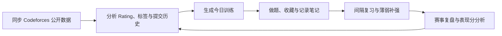

每个模块都不是一座孤岛：今日题单会参考你的能力画像，错题会进入复习队列，比赛中没解决的问题可以继续补题，而新的结果又会反过来修正后续训练方向。

## 简体中文与 English 双语界面

CF Compass 的应用界面现已支持 **简体中文 / English 一键切换**。打开左下角的 **外观设置 → 界面语言**，选择语言后立即生效；选择结果保存在本机，重新启动软件后仍会沿用。

- 首次启动会跟随系统语言：中文系统默认简体中文，其他系统默认 English；已经保存过的语言选择不会被覆盖。
- 题库、今日训练、复习库与时间轴、赛事中心、赛事复盘、模板库、数据中心、笔记弹窗及系统文件选择窗口均纳入同一套语言层。
- 日期、数字、动态计数、状态提示、搜索框和无障碍标签会随界面语言切换。
- Codeforces 官方题名、本地模板文件名、模板题意和用户笔记保持原文，软件不会擅自机器翻译用户内容。

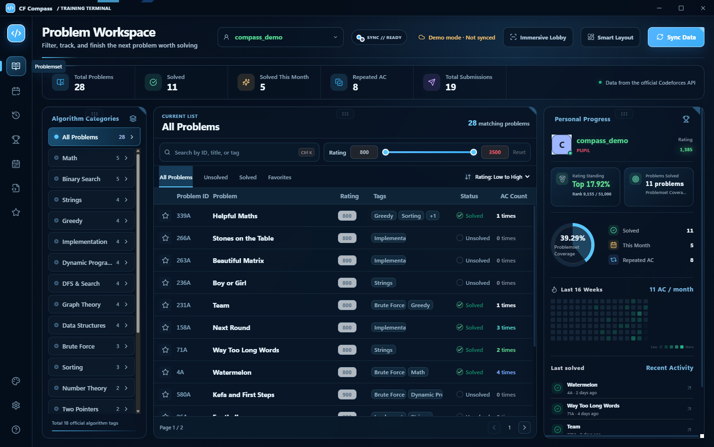

<p align="center"><sub>English 界面 · 使用虚构演示账号，不包含本机路径或私人训练数据</sub></p>

## 核心功能

### 1. 题库工作台：从几千道题里找到“下一道”

题库工作台把筛选、进度和个人状态放在同一个视野里：

- 按算法标签、Rating、关键词和完成状态组合筛选。
- 区分未通过、已通过、已收藏与重复 AC。
- 查看标签题量、近期活动、AC 质量和个人训练概览。
- 一键打开 Codeforces 原题，减少在多个页面之间来回跳转。
- 使用分页、排序和 Rating 区间快速收窄范围。

它不是简单复刻 Codeforces 题库，而是把“公共题目”重新组织成“与你有关的题目”。

### 2. 今日训练：把模糊目标变成可执行题单

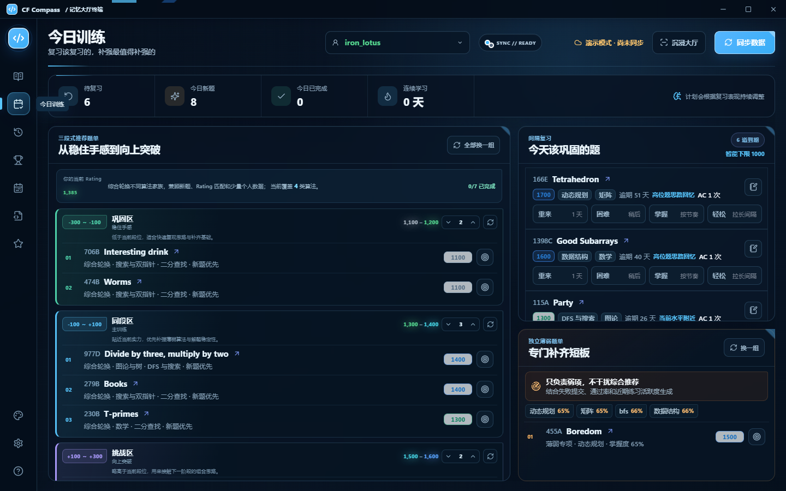

<p align="center"><sub>三段式推荐、到期复习与薄弱专题在同一页完成</sub></p>

今日训练将候选题拆成三个难度带：

- **巩固区**：低于当前水平，练习稳定性、速度与基础完整度。
- **同段区**：贴近当前水平，承担每天最主要的能力训练。
- **挑战区**：略高于当前水平，用于试探并打开新的上限。

你可以独立调整每一档的每日数量或重新生成某一组题，而不必推翻整套计划。页面还会同时展示：

- 今日待复习题目与到期数量。
- 根据标签表现生成的薄弱专题。
- 推荐理由、目标 Rating 与当前完成进度。
- 连续训练天数和当天完成情况。

### 3. 复习库：让 AC 不再等于“从此忘记”

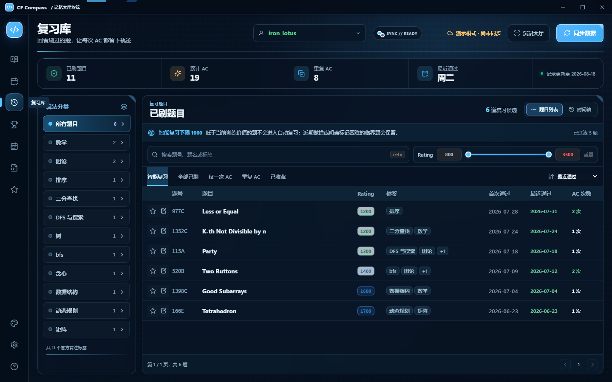

<p align="center"><sub>按标签、Rating、通过次数与复习状态重新找到值得回看的题</sub></p>

做过一道题只是起点。复习库负责把短暂理解慢慢变成稳定能力：

- 将错题、值得重做的题和比赛补题加入队列。
- 按复习反馈安排后续节奏，区分困难、掌握和轻松。
- 为题目保存本地笔记，保留关键观察与易错点。
- 按时间线和统计视图观察复习积累。
- 结合标签表现生成独立薄弱题单。

这套机制像给知识加了一根回弹绳：即使暂时离开，它也会在合适的时间把题目送回你面前。

#### 复习时间轴：把训练历史还原成一条可回看的路线

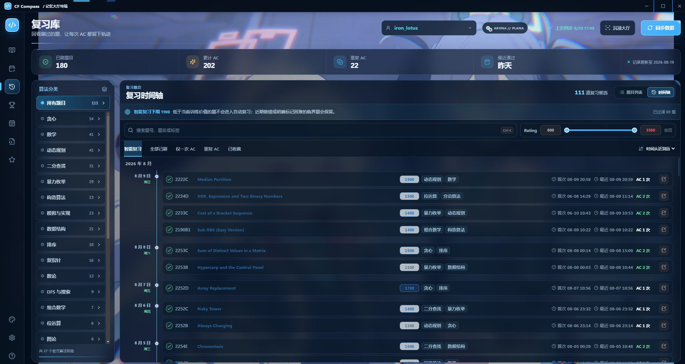

<p align="center"><sub>按日期聚合通过记录；演示账号与训练数据已获授权，未包含电脑路径等设备信息</sub></p>

复习库提供题目列表与时间轴两种观察方式。列表视图适合按 Rating、标签、收藏状态和 AC 次数快速筛选；时间轴则更像一卷训练胶片，按日期还原每一天完成了什么：

- 同一天通过的题目集中成组，月份、日期和星期一目了然。
- 每条记录同时保留题号、题名、Rating、算法标签、首次通过时间、最近通过时间与 AC 次数。
- “首次通过”帮助回忆知识第一次建立的时间，“最近通过”与重复 AC 次数则用于判断它是否已经稳定掌握。
- 智能复习、全部已刷、仅一次 AC、重复 AC、已收藏等筛选可以继续与搜索、标签和 Rating 区间组合使用。
- 支持按时间远近排序，既能回顾最近的训练节奏，也能向前寻找长期没有重做的旧题。

因此，时间轴不是为了“好看地记流水账”，而是让训练频率、重复巩固和知识遗忘变得可观察：某个标签长时间没有出现，或一道难题始终只有一次 AC，都能成为下一轮复习的线索。

### 4. 赛事复盘：把一场比赛拆成可以改进的证据

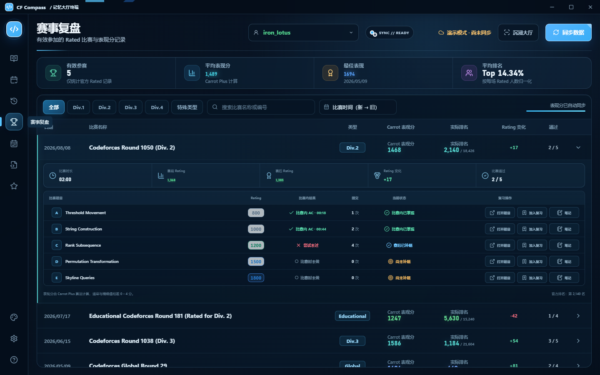

<p align="center"><sub>表现分、实际排名、Rating 变化与逐题状态集中呈现</sub></p>

赛事复盘不只记录最终名次，还会整理比赛过程与赛后状态：

- 筛选并浏览有效参加的 Rated 比赛。
- 查看估算表现分、实际排名、Rating 变化和通过数量。
- 展开比赛，逐题查看赛时结果、尝试次数与当前掌握状态。
- 区分赛时 AC、赛后补题和仍待解决的问题。
- 将未掌握题目直接加入复习库，继续完成赛后训练。

表现分为训练分析用途的估算值，不代表 Codeforces 官方额外评分。

### 可选 AI 比赛复盘

AI 比赛复盘把比赛结果和提交过程整理成可执行的复盘建议。在 **数据中心 → 比赛 AI 复盘** 中配置 DeepSeek API 后，从赛事详情主动打开 **AI 复盘** 或 **增强复盘**；结果会先以草稿展示，确认后再保存到本地学习记录。

- 普通复盘根据比赛摘要、逐题提交统计、比赛状态和本地笔记，分析时间分配、表现较好的地方、主要问题和下一步行动。
- 源码增强复盘是独立的可选能力，需要自己的 Codeforces API Key / Secret。它会整理本场完整提交时间线，对已获取源码的相邻版本生成 Diff，并在确认后将这些代码证据交给 AI 分析。
- 源码、Diff 和 API 凭证不会写入普通学习数据、JSON 导出或自动备份；重新打开源码增强复盘时会重新读取提交源码。
- 功能默认关闭，不参与自动同步。AI 输出只用于复盘建议，不替代 Codeforces 官方结果，也不会自动修改题目笔记、复习反馈或训练计划。
- 训练建议基于本机同步的 Codeforces 题库先做硬筛选，排除本场原题、已解决、已计划、重复和无效候选，再展示题目、难度与推荐依据；用户确认后才会收藏、记录笔记或加入目标题单。

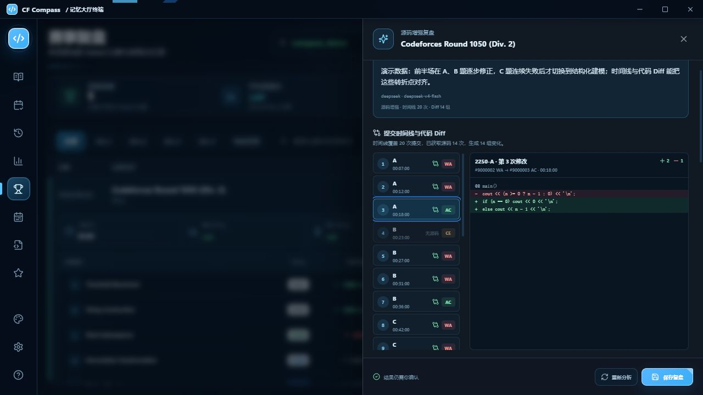

### 5. 全局笔记与目标题单：让“以后再做”真的有下文

一道值得回看的题，不必因为入口不同而留下五份互不相干的记录：

- 在题库、今日训练、复习库、赛事复盘、AI 推荐和目标题单中打开同一份题目笔记。
- 将想学、想补或想重做的题加入目标题单，并按加入时间、难度或状态排序。
- 目标题单可以独立打开、调整窗口大小；完成项保留划线状态，方便回看训练轨迹。
- 笔记和题单在窗口之间同步，随本地学习数据一起导出、导入和备份。

它像训练系统里的“收件箱”：灵感、欠账和下一步先可靠地接住，再由你决定什么时候处理。

### 6. 赛事中心：把参赛计划也放进训练系统

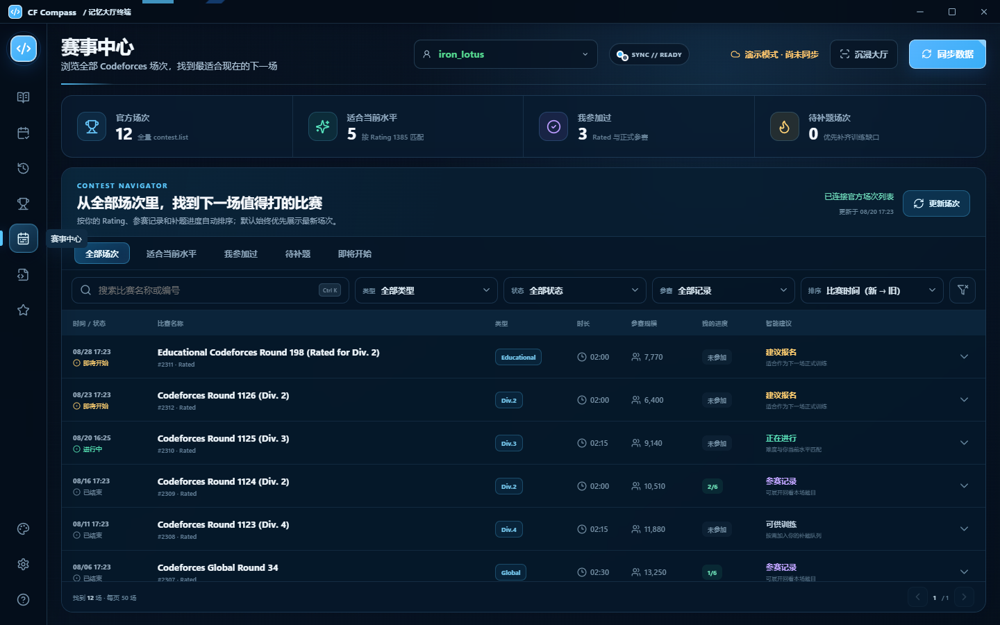

<p align="center"><sub>在全部场次中搜索、筛选并判断下一场值得参加的比赛</sub></p>

赛事中心把 Codeforces 场次从一条长长的时间列表，整理成可以检索和判断的比赛地图：

- 按比赛名称或编号搜索，并按时间、类型、状态和参赛记录组合筛选。
- 自动识别 Div.1—Div.4、Educational、Global、ICPC 与其他特殊类型。
- 区分即将开始、正在进行和已经结束的场次。
- 展示比赛时长、参赛规模以及与当前 Rating 的匹配建议。
- 快速查看“适合当前水平”“我参加过”“待补题”和“即将开始”的比赛。
- 展开场次查看题目与规模，从赛前选择自然衔接到赛后复盘。

赛事检索回答“下一场参加什么”，赛事复盘回答“上一场留下了什么”。两个页面合在一起，比赛便不再是训练计划之外的孤立事件。

### 7. 本地模板库：代码、题意和适用场景放在一起

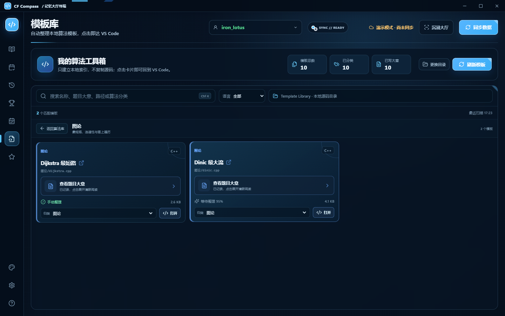

<p align="center"><sub>按算法分类浏览本地源码，并直接回到 VS Code</sub></p>

模板库不是把源码复制进另一个数据库，而是为你的本地算法目录建立一层轻量索引：

- 扫描用户选择的源码文件夹，不复制或上传模板内容。
- 自动归纳算法分类，也允许手动调整归属。
- 按名称、题意、相对路径、算法分类和编程语言搜索。
- 在卡片上查看来源、置信度、文件大小与摘要状态。
- 点击模板直接回到 VS Code 中的对应源码。
- 刷新目录即可发现新增或调整后的模板文件。

更特别的是，每个源码模板都可以拥有一份适合阅读的“题目大意”：

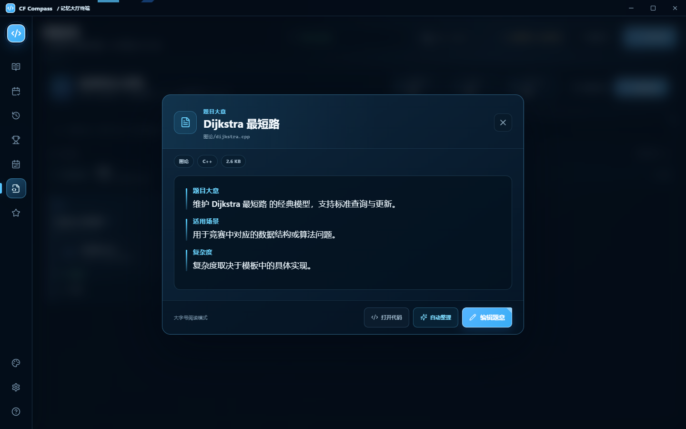

- 保存紧凑的题意、输入输出、关键约束、适用场景和复杂度。
- 把混在一行的结构拆成清晰章节，合并异常空行。
- 规范常见上下标、幂、比较符号、乘号与科学计数法。
- 在阅读模式和编辑模式之间切换，并提供自动整理入口。

这样一份模板不再只是“某个能跑的 cpp 文件”，而是带着用途、边界与记忆线索的算法工具。

### 8. 数据中心：数据属于你，而不是某个云端账户

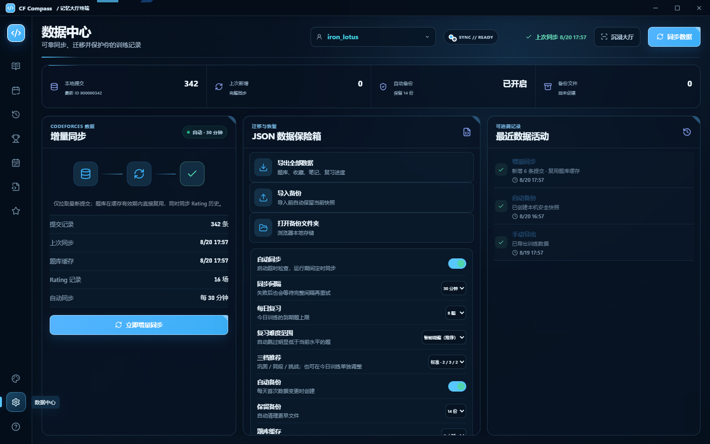

- 训练记录、笔记、复习状态与设置默认保存在本机。
- 增量同步只拉取新提交，题目全集在缓存有效期内直接复用。
- 支持 JSON 导入、导出、每日自动备份和导入前安全快照。
- 可以迁移电脑、恢复误操作，或从活动时间线检查数据发生过什么变化。
- 复习数量、推荐梯度、缓存时长和备份保留数量集中管理。
- 不要求注册额外账户，也不接收 Codeforces 密码。

第一次使用、迁移电脑和误操作恢复方法见 [数据中心完整指南](./docs/DATA_CENTER_GUIDE.md)。

### 9. 训练分析：把进步画成一张可以探索的地图

个人数据中心支持生涯、近一年、近三个月、近一个月、近两周和自定义日期范围。四张核心指标卡、Codeforces Rating 曲线、算法通过率排行与每日 Accepted 节奏共用同一时间窗口：

- Rating 图按照 Codeforces 段位着色，节点可查看比赛、变化和排名。
- 鼠标滚轮围绕指针位置放缩时间范围，也可用底部双手柄精确选取。
- 算法通过率按真实提交计算并从高到低排行，全部算法可在面板内滚动查看。
- 首次通过、总提交、Accepted 比例和活跃天数不会混用不同时间口径。

这不是一张静态成绩单，而是一块训练仪表盘：既能看长期趋势，也能把镜头拉近到最近两周寻找突破口。

### 10. 可定制桌面工作台：让常用功能永远在手边

- 隐藏暂时不用的左侧入口，随时从设置中恢复，并拖动调整顺序。
- 赛事复盘使用完整页面承载时间线、逐题状态与 AI 证据，减少狭窄面板里的来回切换。
- 提供小、中、大三档界面字号，语言、主题、背景与可选本地素材都保留为本机偏好。
- 桌面端负责窗口、文件选择、VS Code 跳转、本地备份等系统能力；浏览器预览则用于快速查看界面。

## 适合哪些人

- 想系统提升、却经常在“今天刷什么”上消耗精力的人。
- 已经做过不少题，希望建立复习与错题闭环的人。
- 经常参加 Rated 比赛，需要分析表现分和补题进度的人。
- 拥有本地算法模板库，希望把源码与题意摘要统一管理的人。
- 更偏爱桌面应用、本地存储和可掌控数据的人。

## 三套原创主题色

开源版固定保留三套纯 CSS 主题，不依赖第三方壁纸或角色素材。

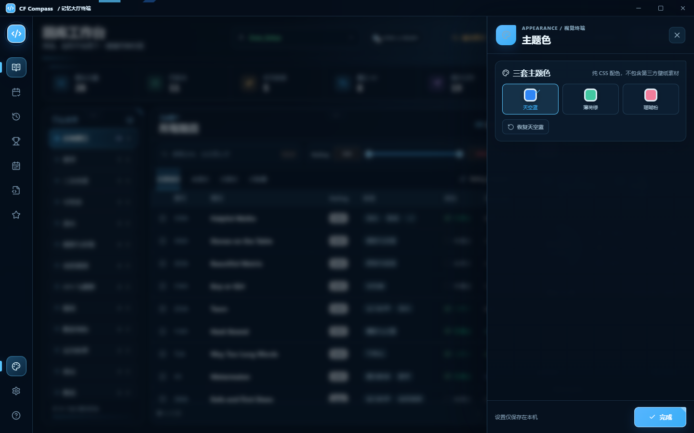

| 主题 | 标识 | 主色 | 视觉气质 |
| --- | --- | --- | --- |
| 天空蓝 | `sky` | `#2F86F6` | 清澈、专注，默认主题。 |
| 薄荷绿 | `mint` | `#43C7A1` | 柔和、舒缓，适合长时间使用。 |
| 珊瑚粉 | `coral` | `#F27D9B` | 明快、醒目，强调关键状态。 |

### 可选人物与背景素材

开源版不打包第三方角色图片，但支持用户从原作者或官方渠道自行取得 PNG、JPG、WebP、MP4、WebM 素材，再通过 **外观设置 → 本地人物与背景 → 导入本地素材** 一键载入。文件只会复制到 CF Compass 的本机数据目录，不进入项目源码，也不会随同步上传。

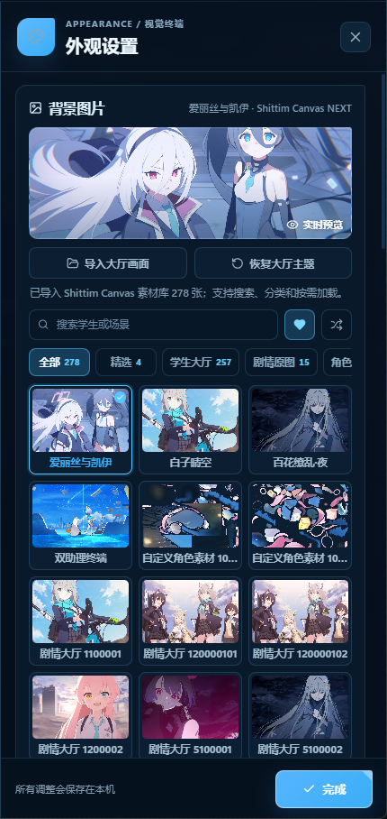

> 图中角色图片来自用户自行准备的本地资源，仅用于展示完整素材库的界面效果；GitHub 仓库和 Windows EXE 均不包含这些第三方原图。

素材来源、许可边界、推荐尺寸和完整操作步骤见 [可选人物与背景素材指南](./docs/OPTIONAL_CHARACTER_ASSETS.md)。

三种可见度模式、五项画面参数、九宫格焦点和自动化开关见 [外观设置完整指南](./docs/APPEARANCE_GUIDE.md)。

## 快速开始

### 下载桌面版本

打开 [Latest Release](https://github.com/Binah-Dev/cf-compass/releases/latest)，按设备下载：

```text
Windows x64（推荐安装版）: CF-Compass-4.1.0-Windows-x64-Setup.exe
Windows x64（便携版）:     CF-Compass-4.1.0-Windows-x64-portable.exe
Linux x64:                CF-Compass-4.1.0-Linux-x86_64.AppImage
Linux Debian x64:         CF-Compass-4.1.0-Linux-amd64.deb
macOS Intel:              CF-Compass-4.1.0-macOS-x64.dmg
macOS Apple 芯片:          CF-Compass-4.1.0-macOS-arm64.dmg
```

Windows 用户推荐下载 `Setup.exe` 安装版：应用只在安装时解压，之后从已安装目录直接启动，速度更稳定。`portable.exe` 便携版无需安装，但每次启动都要先释放程序文件，在机械硬盘、低速设备或杀毒软件扫描环境下会明显更慢。v4.1.0 的 Windows、Linux 与 macOS 包均由同一版本提交在对应原生环境重新构建。Linux 可选择 AppImage 或 Debian 包；macOS 请按芯片选择 Intel 或 Apple 芯片版本。v3.12.1 起 macOS 应用会执行完整的 ad-hoc 签名与 CI 签名校验，但由于项目尚无付费 Apple Developer ID，仍未经过 Apple 公证，首次打开时可能需要在“隐私与安全性”中确认来源。

每个安装包旁都有同名 `.sha256`，Release 还提供汇总文件 `SHA256SUMS.txt`。例如 Windows 可在 PowerShell 中运行：

```powershell
Get-FileHash -Algorithm SHA256 .\CF-Compass-4.1.0-Windows-x64-Setup.exe
```

Linux 或 macOS 可运行：

```bash
sha256sum -c SHA256SUMS.txt --ignore-missing
```

macOS 也可使用 `shasum -a 256 <文件名>`，将结果与对应 `.sha256` 文件核对。

如果 macOS 在完成校验后仍将未公证应用提示为“已损坏”，请先把应用复制到 `/Applications`，再运行：

```bash
xattr -dr com.apple.quarantine "/Applications/CF Compass.app"
```

该命令只应对从本仓库 Release 下载且 SHA-256 一致的文件使用。

当前公开构建未购买商业代码签名证书，因此 Windows SmartScreen 可能显示“未知发布者”。请只从本仓库 Release 下载，并在运行前核对 SHA-256；这不影响应用功能。

### 从源码运行

### 环境要求

- Windows、Linux 或 macOS
- Node.js 22（CI 使用版本）
- pnpm 11.19.0（已在 `package.json` 中锁定）
- Git

```powershell
git clone https://github.com/Binah-Dev/cf-compass.git
cd cf-compass
corepack enable
pnpm install --frozen-lockfile
pnpm desktop
```

首次启动后，在顶部输入 Codeforces Handle 即可同步公开数据。CF Compass **不需要 Codeforces 密码，也不会代替你提交代码**。

只想查看浏览器界面时，可以运行：

```powershell
pnpm dev
```

## 构建与验证

```powershell
# 验证前端生产构建
pnpm verify

# 生成 Windows 解包目录
pnpm desktop:pack

# 同时生成 Windows 推荐安装版与便携版
pnpm desktop:build

# 生成 Linux AppImage 与 deb
pnpm desktop:build:linux

# 生成 macOS Intel 与 Apple 芯片 dmg（需要 macOS）
pnpm desktop:build:mac
```

构建产物位于 `release/`，不会提交到 Git。正式 Release 提供 Windows x64 安装版与便携版、Linux x64、macOS Intel 与 macOS Apple 芯片包，并附独立 SHA-256 和总校验清单。

主分支和 Pull Request 会自动安装依赖、检查生产依赖安全性并运行重点回归测试；版本标签会在 GitHub Actions 的 Windows、Linux 与 macOS 环境中分别构建真实安装包，全部成功后才创建 Release。

## 技术组成

| 层次 | 技术与职责 |
| --- | --- |
| 桌面运行时 | Electron，负责窗口、本地数据与系统集成。 |
| 用户界面 | React + Vite，负责训练工作台与交互。 |
| 数据来源 | Codeforces 公开 API 与用户选择的本地模板目录。 |
| 本地能力 | JSON 数据、备份、导入导出和模板摘要。 |
| 持续验证 | GitHub Actions 三平台构建、重点回归测试与 SHA-256 校验。 |

<details>
<summary><strong>查看项目目录</strong></summary>

```text
cf-compass/
├─ src/                 React 界面、训练逻辑与三套主题色
│  ├─ components/      页面与可复用组件
│  ├─ data/            演示数据及静态配置
│  └─ lib/             Codeforces、训练、复习与格式化逻辑
├─ electron/            Electron 主进程、本地存储与系统集成
├─ scripts/             回归测试与质量检查脚本
├─ docs/screenshots/    README 演示截图
├─ build/               原创应用图标
└─ .github/             CI、Issue、PR 与依赖更新配置
```

</details>

## 隐私与开源边界

- 普通 Codeforces 同步只读取公开 API 数据；源码增强复盘仅在用户明确配置凭证后访问自己的受保护提交源码。
- 训练记录、笔记、模板摘要、设置和备份默认留在本机。
- 仓库不包含真实用户数据、访问令牌或维护者的本机路径。
- 公开版本不分发可复用的角色原图、游戏素材或第三方壁纸；文档中的低分辨率界面截图仅用于说明本地导入效果。用户可以从合法来源取得素材并仅在本机导入。
- 演示截图使用虚构数据或经软件使用者明确授权的训练统计，不包含 Windows 用户名、绝对路径、私人备份名或访问令牌。

提交 Issue 或截图前，请移除不希望公开的 Handle、日志、本地路径与备份内容。安全问题请使用仓库的 **Security → Report a vulnerability** 私密入口，具体流程见 [SECURITY.md](./SECURITY.md)。

## 参与贡献

欢迎提交 Issue、功能建议和 Pull Request：

- [CONTRIBUTING.md](./CONTRIBUTING.md)：开发流程、验证要求和开源版边界。
- [CODE_OF_CONDUCT.md](./CODE_OF_CONDUCT.md)：社区行为准则。
- [SECURITY.md](./SECURITY.md)：安全问题报告方式。
- [CHANGELOG.md](./CHANGELOG.md)：版本变化记录。
- [CREDITS.md](./CREDITS.md)：第三方依赖与项目声明。

涉及界面的 Pull Request 请附上不含个人信息的截图；涉及数据结构时，请说明兼容性和迁移方式。

## 常见问题

<details>
<summary><strong>这是 Codeforces 官方应用吗？</strong></summary>

不是。CF Compass 是独立的开源项目，与 Codeforces 没有官方隶属、背书或合作关系。

</details>

<details>
<summary><strong>为什么开源版没有壁纸和角色素材？</strong></summary>

为了让许可证边界清晰、仓库可以安全再分发，公开版本只保留原创代码、应用图标与三套纯 CSS 主题色。

但应用支持本地导入可选人物与背景，具体来源与使用方法见 [素材指南](./docs/OPTIONAL_CHARACTER_ASSETS.md)。

</details>

<details>
<summary><strong>会自动替我提交题目吗？</strong></summary>

不会。CF Compass 负责训练规划、记录与复盘，不接收 Codeforces 密码，也不执行代码提交。

</details>

<details>
<summary><strong>AI 会在后台自动读取提交或修改我的训练数据吗？</strong></summary>

不会。AI 比赛复盘默认关闭，只会在你配置服务并主动打开复盘时运行；结果先作为草稿展示，保存以及收藏、笔记、目标题单等操作都需要用户确认。

</details>

<details>
<summary><strong>Windows 安装版和便携版应该选哪个？</strong></summary>

日常使用推荐 `Setup.exe`：安装一次后直接从已安装目录启动。`portable.exe` 无需安装，适合临时体验或放在移动设备中，但每次启动都需要释放程序文件，可能更慢。

</details>

## 许可证

原创代码、应用图标与三套主题色使用 [MIT License](./LICENSE)。第三方依赖及算法归属见 [CREDITS.md](./CREDITS.md)。
