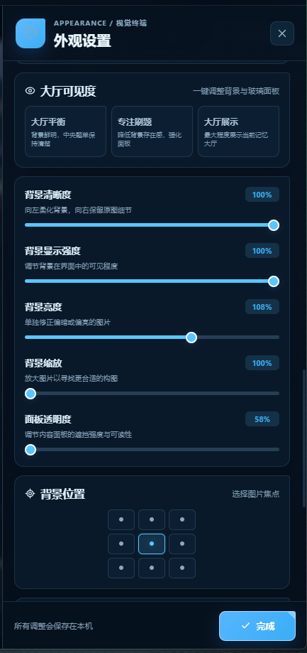
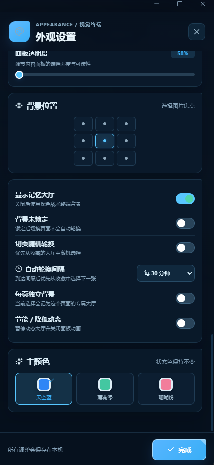

# 外观设置完整指南

CF Compass 的开源版始终只保留天空蓝、薄荷绿、珊瑚粉三套原创主题色。人物和背景是用户自行选择的本地视觉层，不会随仓库、Release、Codeforces 同步或 JSON 训练备份上传。

## 从哪里打开

点击应用左侧栏底部的调色盘图标，打开 **外观设置**。调整会实时预览，点击 **完成** 后保存到本机。

## 本地人物与背景

1. 点击 **导入本地素材**。
2. 选择一张图片或一个视频。
3. 导入完成后，可用下方参数调整构图和可读性。
4. 点击 **更换素材** 可覆盖上一份素材；点击 **移除素材** 会删除 CF Compass 保存的应用副本并恢复纯 CSS 背景。

支持格式和原始来源说明见 [可选人物与背景素材指南](./OPTIONAL_CHARACTER_ASSETS.md)。

## 三种大厅可见度

| 模式 | 背景表现 | 面板表现 | 适用场景 |
| --- | --- | --- | --- |
| 大厅平衡 | 清晰、存在感适中 | 内容保持清楚 | 日常默认，兼顾人物和题目。 |
| 专注刷题 | 稍柔和、偏暗 | 面板更实、更易读 | 长时间刷题、模板阅读。 |
| 大厅展示 | 最明亮、最突出 | 面板更通透 | 截图、浏览数据或欣赏背景。 |

三个按钮只是参数预设，点击后仍可继续微调。



## 五项画面参数

| 参数 | 向左调整 | 向右调整 | 建议 |
| --- | --- | --- | --- |
| 背景清晰度 | 增加柔化，减少细节干扰 | 保留原图细节 | 文字较多时可适当降低。 |
| 背景显示强度 | 背景更淡 | 背景更明显 | 与面板透明度配合调整。 |
| 背景亮度 | 压暗过亮图片 | 提亮过暗图片 | 避免白色人物与文字抢对比度。 |
| 背景缩放 | 接近原构图 | 放大并裁切边缘 | 人物太靠边时可放大后重新选焦点。 |
| 面板透明度 | 面板更通透 | 面板更实、更易读 | 信息密集页面建议提高。 |

## 九宫格背景位置

九个圆点代表图片在窗口中的焦点位置。例如人物位于右侧时选择“右侧”或“右上”，窗口裁切后会优先保留该区域。它不会修改原文件，只改变显示位置。

## 显示与节能

- **显示本地背景**：临时关闭后回到纯 CSS 深色终端；本地素材文件仍然保留，可以随时重新开启。
- **节能 / 降低动态**：暂停视频背景，并减少部分面板动画，适合笔记本、省电或录屏场景。

## 完整本地素材库的自动化控制

下面这些控制用于具有多张候选背景的本地素材库扩展。公开 Release 不内置第三方素材库，因此单文件导入模式下不需要开启随机轮换。



- **背景锁定**：切换页面时保持当前背景，自动轮换也会暂停。
- **切页随机轮换**：每次进入其他功能页时，从候选背景中随机选择；有收藏时优先使用收藏集合。
- **自动轮换间隔**：经过指定时间后更换下一张，锁定状态下暂停计时。
- **每页独立背景**：题库、今日训练、赛事复盘等页面分别记住自己的背景。
- **节能 / 降低动态**：动态大厅停止播放，同时减少页面动画。

这部分截图只用于解释完整本地素材库的交互设计，不表示开源程序自带图中的角色资源。

### 素材清单的质量声明

完整素材包的 `index.json` 可以主动声明某个文件不是全屏大厅，程序会在素材服务入口将其隔离，不让它进入选择、收藏或自动轮换池：

```json
{
  "id": "character-layer-example",
  "name": "角色拆分图层",
  "url": "layers/character.webp",
  "assetRole": "layer",
  "wallpaperReady": false,
  "qualityIssue": "incomplete-layered-asset"
}
```

`assetRole` 支持 `layer`、`sprite`、`thumbnail`、`transition`。完整背景可省略这些字段；如果旧设置仍选中了已隔离文件，应用会自动切换到素材包的安全默认背景。该机制只过滤索引，不会删除用户的原文件。

## 三套主题色

- **天空蓝**：默认色，清晰而专注。
- **薄荷绿**：更柔和，适合长时间使用。
- **珊瑚粉**：更醒目，强调关键状态。

主题色只改变 CF Compass 原创界面变量，不改变人物素材，也不把第三方作品纳入 MIT License。

## 隐私与文件边界

- 导入的素材只保存在当前 Windows 用户的 CF Compass 数据目录。
- 应用不会把图片或视频上传到 Codeforces、GitHub 或其他云端。
- 手动导出的训练 JSON 不包含本地人物或背景文件。
- 提交截图前，应检查 Handle、本机路径、备份文件名和其他身份信息。
- 项目文档使用虚构数据或经过隐私清理的界面，不公开维护者的真实数据路径。
